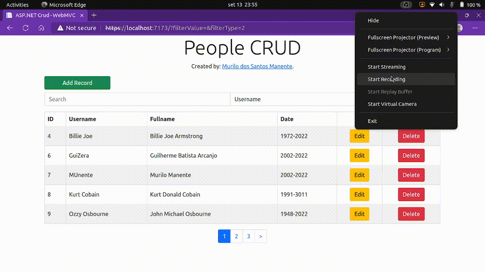

# aspnet_crud

Este é um projeto simples de CRUD de pessoas em uma base de dados. Foi desenvolvido totalmente em ambiente Linux (Distro Ubuntu).

## Tecnologias utilizadas

As principais tecnologias utilizadas neste projeto foram:

* ASP.NET MVC
* ASP.NET Web API
* Bootstrap
* X.PagedList
* SQL Server

## Como funciona o projeto?

### 1. Instalação

#### 1.1. Projeto
Primeiro é necessário verificar se está instalado a última versão do dotnet Runtime e do SDK na máquina (no momento em que este projeto foi criado, foi utilizado a versão 6.0).

Caso não tenha instalado, recomendo dar uma olhada na documentação feita pela própria Microsoft para realizar a instalação:

* [Instalação no Linux](https://docs.microsoft.com/pt-br/dotnet/core/install/linux);
* [Instalação no Windows](https://docs.microsoft.com/pt-br/dotnet/core/install/windows);

Assim que o Runtime e o SDK estiverem instalados, faça um clone do repositório em seu ambiente local.

O projeto é dividido em duas pastas principais: WebAPI e o WebMVC. Ambos são projetos separados com configurações próprias, mas que se comunicam através de rotas (como um microservice).

#### 1.2. Banco de Dados

Para questão do banco de dados, antes estive utilizando uma Instância RDS, porém voltei atrás atualizei o código para utilizar uma Instância local. Enfrentei um pouco de dificuldades de executar o SQL Server direto no Ubuntu, portanto no meu cenário em específico criei um container no docker com o banco e criei a database com os comandos presentes no diretório `./.github/database.sql`. Caso tenham interessem em reproduzir o meu cenário, estou deixando uma documentação que segui, da própria Microsoft, para criação de um container docker rodando o SQL Server no Linux: [Quickstart: Run SQL Server Linux container images with Docker](https://learn.microsoft.com/en-us/sql/linux/quickstart-install-connect-docker). Após ter configurado o banco, verifiquem se a string de conexão, presente em `./WebAPI/Models/Connection.cs`, está batendo com as configurações feitas no docker. Um detalhe importânte: sempre verifiquem se seu container está com o status "Up". Em caso ele venha estar como "Exited", basta apenas rodar o comando `sudo docker start <CONTAINER NAME>` que voltará a ligar.

### 2. Execução

* Entre no diretório do projeto através do terminal/prompt;
* Entre no diretório WebAPI e execute: `dotnet run`;
* Abra um novo terminal/prompt e acesse o diretório WebMVC e logo em seguida rode: `dotnet run`;
* Com o projeto MVC em execução, vá no seu navegador e informe a URL: `https://localhost:7173/`;
* Pronto! O projeto estará rodando por completo;

### Exemplo de Uso

Abaixo está um gif mostrando o uso do sistema.



## Observações

O projeto WebAPI já vem incluso com uma documentação swagger para utilização da API. Para ver a documentação, certifique-se de que o projeto WebAPI esteja em execução. Logo em seguida acesse a URL: `https://localhost:7296/swagger`.

Para saber como está estruturado o banco de dados, deixei o arquivo com os comandos que executei para criação da database dentro do diretório `./.github/database.sql`. Lembrando que este arquivo não está sendo utilizado no projeto, apenas para melhor compreensão dele.

Caso você esteja tendo erro com certificado SSL no projeto, será necessário executar alguns comandos para ativar o certificado SSL para desenvolvimento:

* No Windows:
```
dotnet dev-certs https --trust
```

* No Linux (Distros baseadas no Ubuntu):
```
dotnet dev-certs https
sudo -E dotnet dev-certs https -ep /usr/local/share/ca-certificates/aspnet/https.crt --format PEM
sudo update-ca-certificates
```

Se você estiver utilizando outro sistema operacional, veja a [documentação da Microsoft](https://learn.microsoft.com/en-us/aspnet/core/security/enforcing-ssl?view=aspnetcore-6.0&tabs=netcore-cli#trust-the-aspnet-core-https-development-certificate-on-windows-and-macos) que ensina como ativar o certificado.
